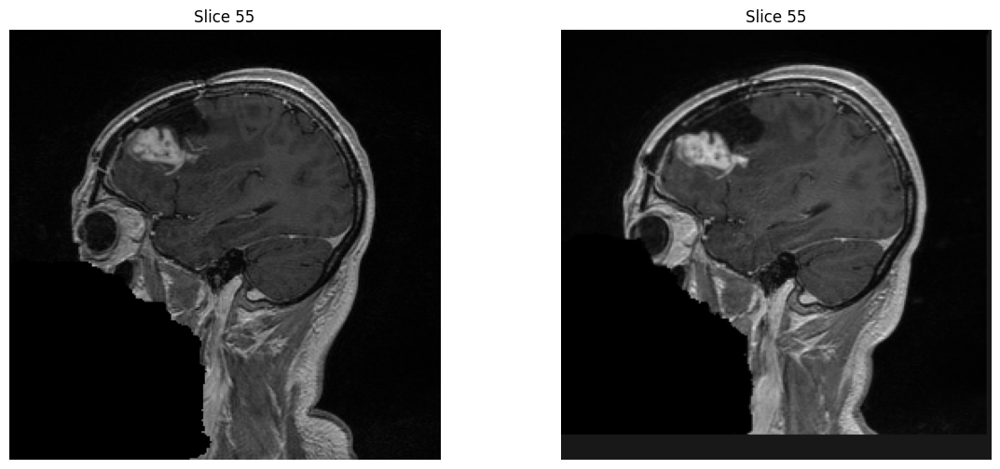
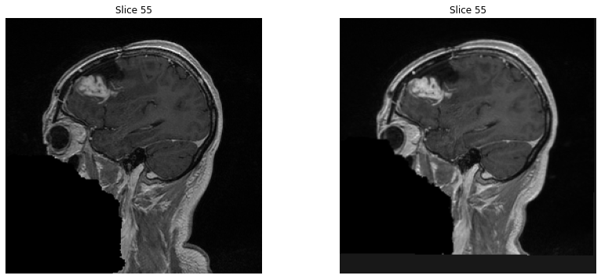
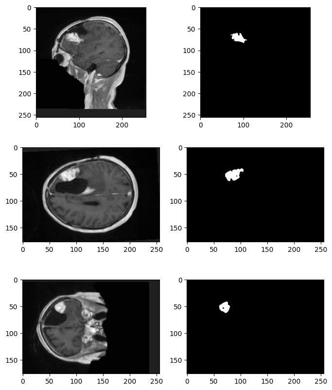
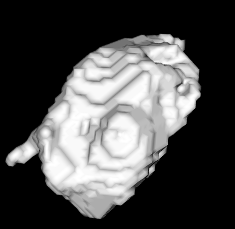

# PROJET ITK-VTK

## Requirements

- Python3

## Installation

```sh
pip3 install -r requirements.txt
```

## Usage

```sh
python3 src/main.py
```

## Configuration

Vous pouvez modifier les variables globales dans le fichier `src/main.py` pour changer le debug et la visualisation des images.

## Organisation

Pour ce projet , nous avons fait du pair programming a l'aide de l'extension live share de vscode pour pouvoir travailler ensemble en distanciel sur un ordinateur.

## Auteurs

- Jean-Yves CHEN (login: jean-yves.chen)
- Quentin ABEL MARCEAU (login: quentin.abel-marceau)


## Recalage d'image

Nous avons testé 2 méthode de recalage : la méthode rigide et la méthode affine.

Pour les 2 méthode de  donne un résultat similaire mais en terme de temps , la méthode rigide est environ 2 fois plus rapide. Pour vérifier quelle méthode est la plus optimale nous avons les résultats suivant :


Recalage rigide


Recalage Affine



Rigid Image Difference

| Statistic          | Value                 |
|--------------------|-----------------------|
| Mean               | 51.14967721138341     |
| Variance           | 10654.82721334736     |
| Sigma              | 103.22222247824041    |
| Sum of Squares     | 153073508367.94022    |
| Standard Deviation | 103.22222247824041    |
| Minimum            | 0.0                   |
| Maximum            | 1368.4420166015625    |

Affine Image Difference

| Statistic          | Value                 |
|--------------------|-----------------------|
| Mean               | 46.917091927121554    |
| Variance           | 9074.344851899896     |
| Sigma              | 95.25935571847994     |
| Sum of Squares     | 130056069715.91301    |
| Standard Deviation | 95.25935571847994     |
| Minimum            | 0.0                   |
| Maximum            | 1358.0                |


En analysant les resultats , elles nous montrent que la méthode affine réduit davantage la différence entre l'image fixe et l'image enregistrée comparativement à la méthode rigid3d. En effet, la différence totale entre les deux images est plus faible avec la méthode affine, ce qui suggère qu'elle est supérieure à la méthode rigid3d pour mesurer la différence entre les images.

C'est pourquoi, à l'avenir, nous allons privilégier la méthode affine pour le recalage d'image.


## Segmentation

L’algorithme de segmentation que nous avons utilisé est un filtre d’image par seuillage connecté. Il s’agit d’une méthode de segmentation semi-automatique qui permet d’isoler une région d’intérêt dans une image en appliquant des seuils précis.

Pour segmenter la tumeur, nous avons défini un seuil supérieur et un seuil inférieur pour délimiter l’intensité des voxels de la tumeur. Nous avons également précisé la position d’un voxel initial appartenant à la tumeur, en utilisant les coordonnées de la tumeur observée dans l’image.

Les seuils et la position de la graine pour nos deux images sont les suivants :

lower_threshold = 500
upper_threshold = 800
seed_position = (90, 70, 51)

L’algorithme procède alors à la propagation de la segmentation à partir de la graine dans l’image, en examinant les voxels adjacents. Si la valeur d’un voxel voisin se situe entre les seuils inférieur et supérieur, ce voxel est considéré comme faisant partie de la région d’intérêt et est étiqueté avec une valeur spécifique






## Visualisation des changements

Pour la visualisations des changements , nous somme partie sur 3 axes différent :

- Similarité de Dice
- Différence volumique
- Différence d'intensité


Le coefficient de similarité de Dice, qui est de 0.0032, indique un très faible chevauchement entre les deux régions tumorales. Cela signifie que l'intersection des régions tumorales dans les deux images est extrêmement réduite par rapport à leur union.

La différence de volume entre les deux régions tumorales est de 72930.0 unités cubes, ce qui montre une disparité significative de taille entre elles. La deuxième tumeur, dont le volume est de 2119560.0 unités cubes, est plus grande que la première, qui a un volume de 2046630.0 unités cubes.

La différence d'intensité des valeurs de voxels entre les deux régions tumorales est de 0.06296 . Cela reflète une dissimilarité dans les intensités des pixels entre les deux tumeurs. Une différence d'intensité plus élevée suggère que les deux tumeurs ont des caractéristiques d'intensité de pixels distinctes.

# Conclusion

Dans ce projet, nous avons principalement expérimenté avec ITK et brièvement VTK pour la visualisation. ITK est un outil très puissant dans le domaine médical et de la segmentation, produisant des résultats plus que satisfaisants. La seule difficulté réside dans l'adaptation de la graine (seed) pour chaque modèle. Cependant, on peut supposer que cette difficulté pourrait être résolue assez facilement grâce au machine learning. Nous sommes tout de même satisfaits d’avoir appris à utiliser ces outils dans le cadre du projet et espérons pouvoir les utiliser à nouveau à l’avenir.